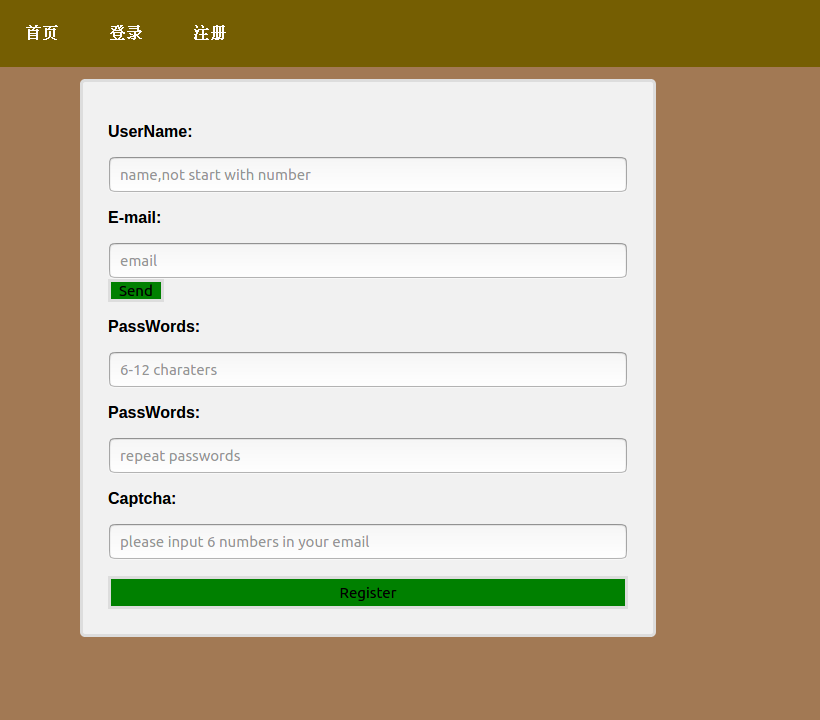

### 纯文字微博v2
(redis缓存，celery+redis异步邮件，gunicore gevent高并发,nginx+supervisor部署)

#### Installation
```
$ git clone https://github.com/gcyangxin/Flask-trainning.git
```
#### dependency
```
$ virtualenv -p /usr/bin/python3 myenv # for Python3 on Linux & macOS
$ source myenv/bin/activate
$ pip install -r requirements.txt
```
#### config
```
$ gedit myapp/config.py
`SECRET_KEY=your key`
`SQLALCHEMY_DATABASE_URI=your uri`
```
#### managerdB
```
python manager.py schema_create #createTables
```
#### run for develop
```python run.py```

#### run for product
```gunicore -c gun.py run:app```

#### nginx and supervisor
```https://blog.csdn.net/gcyangxin/article/details/107460610```

#### 可改进
- log功能
- 404页面重写
- 删改，注销
